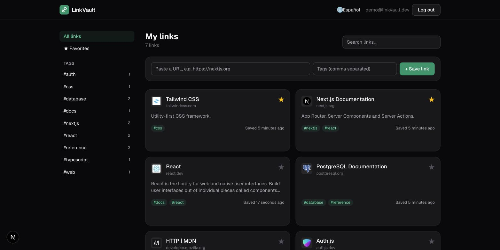

# LinkVault

[](https://github.com/MigueIAngel/linkvault/actions/workflows/ci.yml)


A bookmark manager built with the **Next.js 16 App Router**. Paste a URL and LinkVault fetches the page title and description on the server; you organize links with tags and favorites and find them with search. The UI is available in English and Spanish.



## Features

- **Server Components + Server Actions**: no REST layer. Mutations are type-safe functions called from forms
- **Automatic metadata**: Open Graph and `<title>` parsing on the server, with a timeout, a size limit and an SSRF guard (private hosts are never fetched)
- **Tags, favorites and search** with URL-driven filters (`?q=&tag=&fav=1`) and "load more"
- **React 19 patterns**: `useActionState` for forms, `useOptimistic` for favorites, `useTransition` for the debounced search
- **Authentication with Auth.js v5**: email + password (bcrypt, JWT sessions) and GitHub OAuth, which turns on when credentials are configured. Data is always scoped to the signed-in user
- **i18n with next-intl**: `/en` and `/es` routes, locale detection in `proxy.ts` (Next 16), localized metadata, plurals and relative dates
- **Prisma 7** with the PostgreSQL driver adapter, migrations and a seed script
- Dark mode, responsive layout, accessible controls
- Tests with Vitest, Docker (standalone output) and CI

## Tech stack

| Area | Tools |
|---|---|
| Framework | Next.js 16 (App Router, Server Actions, Turbopack), React 19, TypeScript |
| Data | Prisma 7, PostgreSQL 16 |
| Auth | Auth.js (next-auth v5) + Prisma adapter |
| i18n | next-intl 4 |
| UI | Tailwind CSS 4 |
| Quality | Vitest, ESLint, GitHub Actions |
| Deployment | Docker (standalone), docker-compose |

## Getting started

### Docker

```bash
AUTH_SECRET=$(openssl rand -base64 32) docker compose up --build
```

Open http://localhost:3000 and log in with **demo@linkvault.dev / demo12345**.

### Local development

```bash
npm install
cp .env.example .env            # set DATABASE_URL and AUTH_SECRET
docker compose up -d db         # or use your own PostgreSQL
npx prisma migrate dev
npx prisma db seed
npm run dev
```

To enable GitHub login, create an OAuth app with the callback URL `http://localhost:3000/api/auth/callback/github` and set `AUTH_GITHUB_ID` and `AUTH_GITHUB_SECRET`.

### Scripts

```bash
npm test          # Vitest
npm run lint      # ESLint
npm run build     # production build
```

## Project structure

```
src/
├── actions/          # Server Actions (auth, links)
├── app/
│   ├── [locale]/     # landing, login, register, links dashboard
│   └── api/auth/     # Auth.js route handlers
├── components/       # UI components (client and server)
├── i18n/             # next-intl routing, request config, navigation
├── lib/              # db client, queries, URL + metadata helpers
├── auth.ts           # Auth.js configuration
└── proxy.ts          # locale routing (formerly middleware.ts)
messages/             # en.json, es.json
prisma/               # schema, migrations, seed
```

## License

MIT
